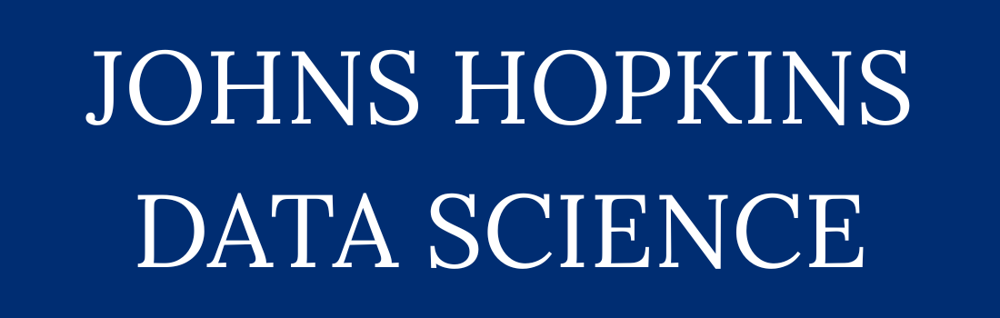

# Johns Hopkins Data Science Specialization

This repository contains my personal notes and resources from the Data Science Specialization by Johns Hopkins University on Coursera.

The specialization consists of 10 courses that cover the full data science pipeline, from asking the right questions, learning basic tools to building and evaluating machine learning models. I’m documenting my learning journey here, including summaries, code snippets, and practical insights.

## 🧠 Why I'm Doing This

- Reinforce key concepts by writing them out
- Create a reference for future use
- Help others who may be learning alongside me

## 📜 License

All original notes and code in this repository are available under the MIT License. You’re welcome to use, adapt, and contribute if you find them useful.

---

Maintained by [Syed Umair Ali](https://github.com/syedumaircodes)
Hosted under the [Crown Notes](https://github.com/crown-notes) organization
